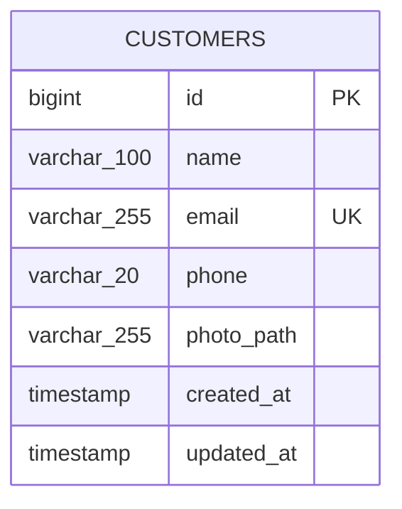

# Gestão de Clientes

Aplicação web para gerenciamento de clientes, desenvolvida como teste técnico com Laravel 13, PHP 8.3 e SQLite. O sistema oferece um CRUD tradicional, upload de fotos e uma interface responsiva construída com Blade e Tailwind CSS.

## Funcionalidades

- Listagem paginada de clientes, ordenada pelos cadastros mais recentes;
- Cadastro com nome, e-mail, telefone e foto obrigatória;
- Edição dos dados com substituição opcional da foto;
- Exclusão definitiva do cliente e da foto associada;
- Normalização de e-mail e telefone antes da persistência;
- Validação e mensagens amigáveis em português;
- Máscara visual de telefone e preview local da foto;
- Feedback de sucesso, confirmação de exclusão e estado vazio;
- Layout responsivo para desktop e dispositivos móveis.

## Requisitos

- PHP 8.3 ou superior;
- extensões PHP exigidas pelo Laravel, incluindo PDO SQLite e Fileinfo;
- Composer 2;
- Node.js e npm.

## Instalação

```bash
git clone <url-do-repositorio>
cd customer-management
composer install
```

Crie o arquivo de ambiente e gere a chave da aplicação:

```bash
cp .env.example .env
php artisan key:generate
```

No Windows PowerShell, o arquivo também pode ser criado com:

```powershell
Copy-Item .env.example .env
```

Crie o banco SQLite vazio:

```bash
php -r "file_exists('database/database.sqlite') || touch('database/database.sqlite');"
```

Execute as migrations e disponibilize os uploads públicos:

```bash
php artisan migrate
php artisan storage:link
```

Instale e compile os assets:

```bash
npm install
npm run build
```

## Execução

Para iniciar o servidor local:

```bash
php artisan serve
```

A aplicação estará disponível, por padrão, em `http://localhost:8000`. Durante o desenvolvimento, execute o Vite em outro terminal:

```bash
npm run dev
```

O projeto também mantém o script padrão de desenvolvimento do Laravel:

```bash
composer run dev
```

## Testes e qualidade

Os testes usam SQLite em memória e um filesystem público falso. Nenhum dado ou upload local é alterado pela suíte.

```bash
php artisan test
vendor/bin/pint --test
npm run build
```

No Windows PowerShell, o Pint pode ser executado com `vendor\bin\pint --test`.

## Configuração

O `.env.example` já está preparado para SQLite. As configurações mais relevantes são:

```dotenv
APP_NAME="Customer Management"
APP_LOCALE=pt_BR
DB_CONNECTION=sqlite
```

O arquivo `database/database.sqlite` é local e não deve ser versionado. A aplicação não depende de registros previamente cadastrados nem de dados de seed. O `DatabaseSeeder` permanece vazio para não criar clientes apontando para fotos inexistentes.

## Estrutura resumida

```text
app/
├── Http/Controllers/CustomerController.php
├── Http/Requests/
│   ├── StoreCustomerRequest.php
│   └── UpdateCustomerRequest.php
└── Models/Customer.php
database/
├── factories/CustomerFactory.php
└── migrations/*_create_customers_table.php
resources/
├── css/app.css
├── js/app.js
└── views/
    ├── layouts/app.blade.php
    └── customers/
tests/Feature/CustomerControllerTest.php
```

## Decisões técnicas

### Arquitetura

Foi adotado o MVC tradicional do Laravel. A aplicação é pequena e mantém as regras de entrada nos Form Requests, invariantes simples no model e a orquestração do CRUD no controller. Não foram introduzidos repositories, services, DTOs ou observers porque não reduziriam a complexidade deste escopo.

### Normalização

- O e-mail passa por `trim` e lowercase antes da validação e também possui mutator defensivo no model.
- O telefone é reduzido a somente dígitos antes da validação e possui o mesmo reforço no model.
- A máscara de telefone existe apenas na interface. O banco sempre armazena a representação normalizada.
- O e-mail possui índice único no banco. A normalização garante a comparação consistente pelo fluxo da aplicação, inclusive no SQLite, cuja unicidade textual padrão é sensível a maiúsculas e minúsculas.

### Fotos e filesystem

As fotos são armazenadas no disk público em `storage/app/public/customers`. O banco guarda somente o caminho relativo em `photo_path`, e `php artisan storage:link` cria a exposição por `public/storage`.

No cadastro, um upload é removido se a persistência do cliente falhar. Na edição, a nova foto é armazenada primeiro; o banco é atualizado em seguida e somente então a foto anterior é removida. Se a atualização falhar, a nova foto é descartada e a anterior permanece intacta. Na exclusão, o registro sofre hard delete e a foto correspondente é removida; um arquivo já ausente não impede a operação.

### Trade-offs

- Não há autenticação ou autorização porque não fazem parte do escopo funcional informado.
- A exclusão é definitiva; não há soft delete.
- A aplicação não processa ou redimensiona imagens, evitando dependências adicionais. Ela valida tipo e tamanho do upload.
- A remoção no banco e no filesystem não é uma transação atômica entre dois recursos diferentes. A ordem adotada prioriza não deixar registros ativos apontando para fotos removidas durante uma atualização.
- A visualização individual não foi criada: a listagem já representa a leitura do CRUD e concentra todas as informações exigidas.

## Modelo de dados



## Screenshots

Seção reservada para screenshots da versão final da aplicação.

- Listagem de clientes: _adicionar screenshot_
- Cadastro de cliente: _adicionar screenshot_
- Edição de cliente: _adicionar screenshot_
