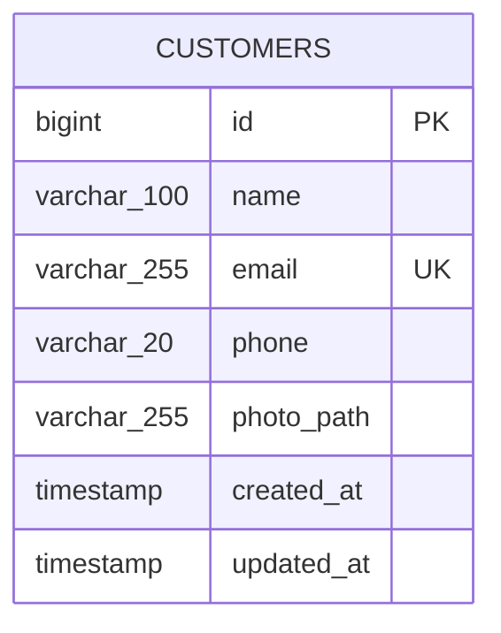

# Gestão de Clientes

Aplicação web para gerenciamento de clientes, desenvolvida como teste técnico utilizando Laravel 13, PHP 8.3 e SQLite.

O sistema implementa um CRUD de clientes com upload de fotos, validação dos dados e interface responsiva construída com Blade e Tailwind CSS.

## Funcionalidades

- Listagem paginada de clientes, ordenada pelos cadastros mais recentes;
- Cadastro de clientes com nome, e-mail, telefone e foto;
- Edição dos dados com substituição opcional da foto;
- Exclusão definitiva do cliente e da foto associada;
- Normalização de e-mail e telefone antes da persistência;
- Validação dos dados com mensagens em português;
- Máscara visual para telefone;
- Preview da foto antes do envio;
- Modal de confirmação antes da exclusão;
- Feedback visual após operações realizadas com sucesso;
- Fallback visual para clientes sem foto disponível;
- Layout responsivo para desktop e dispositivos móveis.

## Tecnologias

- PHP 8.3;
- Laravel 13;
- SQLite;
- Blade;
- Tailwind CSS;
- JavaScript;
- Vite;
- PHPUnit.

## Requisitos

Antes de iniciar, é necessário possuir:

- PHP 8.3 ou superior;
- extensões PHP exigidas pelo Laravel, incluindo PDO SQLite e Fileinfo;
- Composer 2;
- Node.js;
- npm;
- Git.

## Instalação

Clone o repositório:

```bash
git clone https://github.com/MatheusMMarques/Essentia-Group.git
```

Entre na aplicação Laravel:

```bash
cd Essentia-Group/customer-management
```

> A partir deste ponto, todos os comandos devem ser executados dentro da pasta `customer-management`.

Instale as dependências PHP:

```bash
composer install
```

### Configuração do ambiente

Crie o arquivo `.env` a partir do `.env.example`.

No macOS, Linux ou Git Bash:

```bash
cp .env.example .env
```

No Windows PowerShell:

```powershell
Copy-Item .env.example .env
```

Gere a chave da aplicação:

```bash
php artisan key:generate
```

Crie o banco SQLite:

```bash
php -r "file_exists('database/database.sqlite') || touch('database/database.sqlite');"
```

Execute as migrations:

```bash
php artisan migrate
```

Crie o link público utilizado para acessar as fotos enviadas:

```bash
php artisan storage:link
```

### Assets do frontend

Instale as dependências do frontend:

```bash
npm install
```

Compile os assets:

```bash
npm run build
```

#### Windows PowerShell

Em alguns ambientes Windows, a `ExecutionPolicy` do PowerShell pode bloquear a execução do wrapper `npm.ps1`.

Caso isso aconteça, utilize diretamente os executáveis `.cmd`:

```powershell
npm.cmd install
npm.cmd run build
```

Não é necessário alterar a `ExecutionPolicy` do sistema para executar o projeto.

## Execução

Certifique-se de estar dentro da pasta:

```text
Essentia-Group/customer-management
```

Inicie o servidor local do Laravel:

```bash
php artisan serve
```

Por padrão, a aplicação estará disponível em:

```text
http://127.0.0.1:8000
```

Para desenvolvimento do frontend com hot reload, abra outro terminal, entre também na pasta `customer-management` e execute:

```bash
npm run dev
```

Caso o PowerShell bloqueie `npm.ps1`, utilize:

```powershell
npm.cmd run dev
```

O `npm run dev` não é necessário para utilizar a aplicação após a execução de `npm run build`. Ele é destinado ao desenvolvimento do frontend.

## Testes e qualidade

Os testes utilizam SQLite em memória e um filesystem fake, portanto não alteram o banco de desenvolvimento nem os uploads locais.

Execute a suíte de testes:

```bash
php artisan test
```

Verifique a formatação do código PHP com Laravel Pint:

No macOS, Linux ou Git Bash:

```bash
vendor/bin/pint --test
```

No Windows PowerShell:

```powershell
vendor\bin\pint --test
```

Para validar também o build do frontend:

```bash
npm run build
```

Ou, caso necessário no Windows PowerShell:

```powershell
npm.cmd run build
```

## Configuração

O `.env.example` está preparado para utilizar SQLite por padrão.

As principais configurações são:

```dotenv
APP_NAME="Gestão de Clientes"
APP_LOCALE=pt_BR
DB_CONNECTION=sqlite
```

O arquivo `database/database.sqlite` é local e não deve ser versionado.

A aplicação não depende de clientes previamente cadastrados ou de dados de seed. O `DatabaseSeeder` permanece vazio para que uma instalação nova seja iniciada sem registros fictícios.

## Estrutura resumida

```text
customer-management/
├── app/
│   ├── Http/
│   │   ├── Controllers/
│   │   │   └── CustomerController.php
│   │   └── Requests/
│   │       ├── StoreCustomerRequest.php
│   │       └── UpdateCustomerRequest.php
│   └── Models/
│       └── Customer.php
├── database/
│   ├── factories/
│   │   └── CustomerFactory.php
│   └── migrations/
│       └── *_create_customers_table.php
├── resources/
│   ├── css/
│   │   └── app.css
│   ├── js/
│   │   └── app.js
│   └── views/
│       ├── layouts/
│       └── customers/
├── routes/
│   └── web.php
└── tests/
    └── Feature/
        └── CustomerControllerTest.php
```

## Decisões técnicas

### Arquitetura

Foi adotado o padrão MVC utilizando a estrutura nativa do Laravel.

As responsabilidades foram distribuídas da seguinte forma:

- `Model`: representação do cliente e normalizações defensivas;
- `Form Requests`: validação e preparação dos dados recebidos;
- `Controller`: orquestração das operações do CRUD e do ciclo de vida das fotos;
- `Blade`: renderização da interface;
- JavaScript: comportamentos de interface, como máscara de telefone, preview da imagem e modal de confirmação.

Por se tratar de uma aplicação pequena, foram utilizadas as abstrações fornecidas pelo próprio framework.

Não foram introduzidos `Services`, `Repositories`, DTOs ou `Observers`, pois essas camadas adicionariam complexidade sem benefício proporcional para o escopo atual.

### Normalização

O e-mail passa por `trim` e conversão para lowercase antes da validação. O `Model` também possui um mutator defensivo para garantir a mesma normalização quando o atributo é definido por outros fluxos da aplicação.

O telefone é normalizado para conter somente dígitos antes da validação e possui o mesmo reforço no `Model`.

A máscara de telefone existe apenas na interface. O banco armazena sempre sua representação normalizada.

O e-mail possui uma constraint `UNIQUE` no banco de dados. A normalização garante uma representação consistente antes da persistência, inclusive no SQLite, cuja comparação textual para unicidade é case-sensitive por padrão.

### Fotos e filesystem

As fotos são armazenadas no disk público do Laravel:

```text
storage/app/public/customers
```

O banco armazena somente o caminho relativo do arquivo no campo `photo_path`.

O comando:

```bash
php artisan storage:link
```

cria o link necessário em `public/storage` para que os arquivos possam ser acessados pela aplicação.

No cadastro, caso o upload seja concluído mas a persistência do cliente falhe, o novo arquivo é removido.

Na edição, uma nova foto é armazenada antes da atualização do registro. Após a persistência ser concluída com sucesso, a foto anterior é removida. Caso a atualização do banco falhe, a nova foto é descartada e a anterior é preservada.

No `destroy`, o cliente sofre hard delete e a aplicação tenta remover a foto associada. A ausência física de um arquivo não impede a exclusão do registro.

Falhas inesperadas durante a remoção de arquivos são registradas em log sem interromper a operação principal.

### Validação e segurança de entrada

Os campos aceitos por mass assignment são explicitamente definidos no `Model` através de `$fillable`.

Os `Form Requests` validam os dados antes que eles cheguem às operações de persistência.

Valores com tipos inesperados são preservados durante a preparação dos dados para que sejam rejeitados normalmente pela camada de validação, evitando erros internos causados por payloads malformados.

As views Blade utilizam o escaping padrão do framework para a exibição dos dados.

### Trade-offs

- Não há autenticação ou autorização porque esses recursos não fazem parte do escopo funcional solicitado;
- A exclusão utiliza hard delete; não foi implementado soft delete;
- As imagens não são redimensionadas ou processadas após o upload, evitando dependências adicionais fora do escopo;
- Banco de dados e filesystem são recursos independentes e não participam de uma única transação atômica;
- A estratégia adotada para substituição de fotos prioriza não deixar registros ativos apontando para arquivos removidos;
- Falhas de remoção no filesystem são registradas em log, mas não existe mecanismo de retry ou rotina automática para limpeza de arquivos órfãos;
- Não foi criada uma página individual de detalhes (`show`), pois a listagem já apresenta todas as informações solicitadas e representa a operação de leitura do CRUD;
- O SQLite foi escolhido pela simplicidade de instalação e reprodução do projeto, sem impedir a utilização de outro banco suportado pelo Laravel.

## Modelo de dados



A tabela `customers` concentra os dados necessários para o escopo da aplicação. O campo `email` possui restrição de unicidade e `photo_path` armazena apenas a referência relativa ao arquivo no filesystem.
